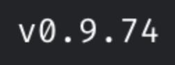
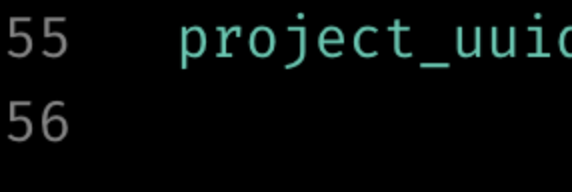
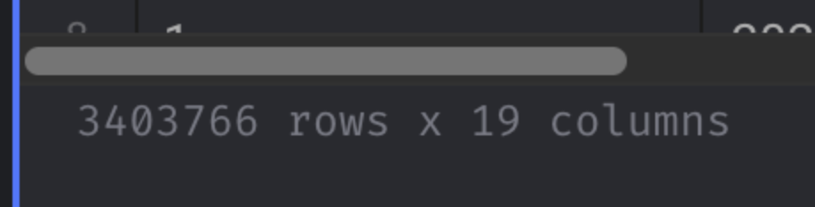
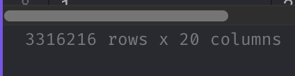

## Question 1. Run Mage

First, let's run Mage with Docker Compose. Follow the quick start guideline.

What's the version of Mage we run?

(You can see it in the UI)



## Question 2. Creating a project

[](https://github.com/LucaSainteCroix/teaching-resources/blob/main/Ressources/MLOps/mlops-zoomcamp/cohorts/2024/03-orchestration/brief-orchestration.md#question-2-creating-a-project)

Now let's create a new project. We can call it "brief_03", for example.

How many lines are in the created `metadata.yaml` file?

* 35
* 45
* 55 
* 65

## Question 3. Creating a pipeline

[](https://github.com/LucaSainteCroix/teaching-resources/blob/main/Ressources/MLOps/mlops-zoomcamp/cohorts/2024/03-orchestration/brief-orchestration.md#question-3-creating-a-pipeline)

Let's create an ingestion code block.

In this block, we will read the March 2023 Yellow taxi trips data.

How many records did we load?

* 3,003,766
* 3,203,766
* 3,403,766 
* 3,603,766

## Question 4. Data preparation

[](https://github.com/LucaSainteCroix/teaching-resources/blob/main/Ressources/MLOps/mlops-zoomcamp/cohorts/2024/03-orchestration/brief-orchestration.md#question-4-data-preparation)

Let's
 use the same logic for preparing the data we used previously. We will
need to create a transformer code block and put this code there.

This is what we used (adjusted for yellow dataset):

```python
def read_dataframe(filename):
    df = pd.read_parquet(filename)

    df.tpep_dropoff_datetime = pd.to_datetime(df.tpep_dropoff_datetime)
    df.tpep_pickup_datetime = pd.to_datetime(df.tpep_pickup_datetime)

    df['duration'] = df.tpep_dropoff_datetime - df.tpep_pickup_datetime
    df.duration = df.duration.dt.total_seconds() / 60

    df = df[(df.duration >= 1) & (df.duration <= 60)]

    categorical = ['PULocationID', 'DOLocationID']
    df[categorical] = df[categorical].astype(str)

    return df
  
```

Let's adjust it and apply to the data we loaded in question 3.

What's the size of the result?

* 2,903,766
* 3,103,766
* 3,316,216 
* 3,503,766
